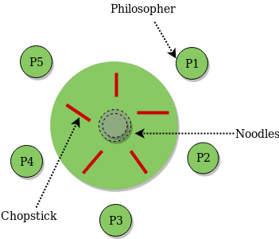

# Jantar Dos Filosofos
Trabalho de sincronização sobre o problema do jantar dos filósofos para a matéria de programação paralela e multi-core.

## Descritivo do trabalho:

- Considere 5 filósofos que passam a vida a pensar e a comer. Compartilham de uma mesa redonda rodeada por 5 cadeiras sendo que cada uma das cadeiras pertence a um filósofo. No centro da mesa encontra-se uma panela de arroz e estão 5 garfos na mesa, um para cada filósofo.
- Quando um filósofo pensa não interage com os seus colegas. De tempos em tempos, cada filósofo fica com fome e tenta apanhar os dois garfos que estão mais próximos (os garfos que estão ou à esquerda ou à direita). **O filósofo apenas pode apanhar um garfo de cada vez** e como o leitor compreende, **não pode apanhar um garfo se este estiver na mão do vizinho.**
- Quando um filósofo esfomeado tem 2 garfos ao mesmo tempo ele come sem largar os garfos. Apenas quando acaba de comer, o filósofo pousa os garfos, libertando-os e começa a pensar de novo. **O nosso objetivo é ter uma representação/implementação que nos permita simular este jantar sem que haja problemas de** ***deadlock ou starvation.***

### Possível solução utilizando semáforo:
- Para isso, o jantar poderá ser modelado usando uma thread para representar cada filósofo e pode ser utilizado semáforos para representar cada garfo. Quando um filósofo tenta agarrar um garfo executa uma operação wait no semáforo, quando o filósofo larga o garfo executa uma operação release nesse mesmo semáforo. Cada filósofo (thread) vai seguir o algoritmo, ou seja, todos fazem as mesmas ações. As primitivas de sincronização wait e release são utilizadas para evitar situações de deadlock.
- Uma outra possibilidade de deadlock seria o fato de mais do que um filósofo ficar com fome ao mesmo tempo, os filósofos famintos tentariam agarrar os garfos ao mesmo tempo. Isso é outro ponto que uma solução satisfatória precisará estar atento, devendo ser evitado que um filósofo possa morrer de fome. Lembrar que uma solução livre de deadlock não elimina necessariamente a possibilidade de um filósofo morrer de fome.

### Requisitos do trabalho:

- É obrigatório contemplar a restrição de deadlock, ou seja, a implementação deve resolver (e evitar) o problema de deadlock;
- É obrigatório contornar o problema de starvation. Os filósofos devem ter um tempo máximo aceitável (individualmente) para ficarem sem se alimentar. Este tempo pode ser um parâmetro definido em milissegundos;
- Nem todas as pessoas se alimentam na mesma velocidade, portanto, cada filósofo deve ter o “seu” tempo necessário para a sua alimentação, que são diferentes uns dos outros.

## Resolução:

### Recursos:
* **Visualização:** Interface gráfica que mostra o estado de cada filósofo e garfo em tempo real.
* **Prevenção de Starvation:** Implementa uma fila de prioridade para garantir que nenhum filósofo espere indefinidamente para comer.
* **Relatórios Detalhados:** Gera relatórios individuais para cada filósofo, mostrando o tempo gasto em cada estado (pensando, esperando, comendo).
* **Personalizável:** Permite configurar o número de filósofos, ciclos de comer e tempo máximo de espera.

### Classes e funções:

#### `Estado`
Enumeração que define os estados possíveis de um filósofo:
* `PENSANDO`: O filósofo está pensando.
* `COM_FOME`: O filósofo está com fome e quer comer.
* `COMENDO`: O filósofo está comendo.

#### `JantarFilosofos`
Classe que gerencia a interface gráfica do programa:
* `__init__`: Inicializa a janela, o canvas e os elementos gráficos (filósofos, garfos e legenda).
* `calcular_posicoes_circulares`: Calcula as posições dos filósofos e garfos em um círculo.
* `desenha_filosofos`: Desenha os círculos que representam os filósofos na interface.
* `desenha_garfos`: Desenha os círculos que representam os garfos na interface.
* `desenha_legenda`: Desenha a legenda que explica as cores dos estados dos filósofos.
* `atualizar_estado`: Atualiza a cor do filósofo na interface de acordo com seu estado.
* `atualizar_garfo`: Atualiza a cor do garfo na interface (verde para ocupado, marrom para livre).
* `atualiza_interface`: Atualiza a interface gráfica.

#### `adicionar_filosofo_na_fila`
Adiciona um filósofo na fila de prioridade, usando o tempo de espera como chave.

#### `proximo_filosofo_na_fila`
Retorna o filósofo com maior prioridade (maior tempo de espera) da fila.

#### `pode_comer`
Verifica se um filósofo pode pegar os garfos, ou seja, se ele está com fome e seus vizinhos não estão comendo.

#### `filosofo`
Função que representa o ciclo de vida de um filósofo: pensar, ficar com fome, tentar comer e, finalmente, comer (se conseguir os garfos).

#### `main`
Função principal que inicializa a interface gráfica, cria as threads dos filósofos e inicia a execução do programa.

### Como Executar

1. Certifique-se de ter o Python 3 instalado.
2. Instale as bibliotecas necessárias: `pip install tkinter colorama`
3. Execute o arquivo Python: `python main.py`

### Observações

* O programa utiliza um semáforo (`mutex`) para controlar o acesso aos garfos, evitando condições de corrida.
* A fila de prioridade garante que nenhum filósofo sofra starvation, ou seja, espere indefinidamente para comer.
* O tempo máximo de espera pode ser ajustado para simular diferentes cenários.
* As cores e o número de filósofos também podem ser personalizados.
